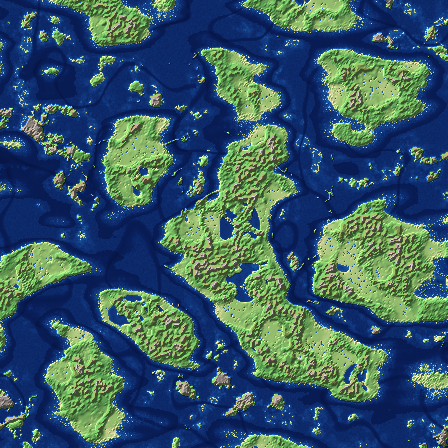
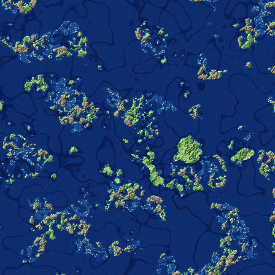
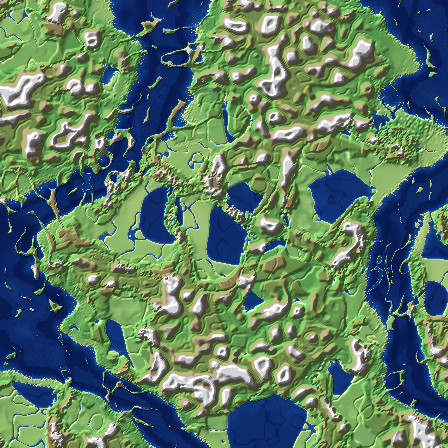
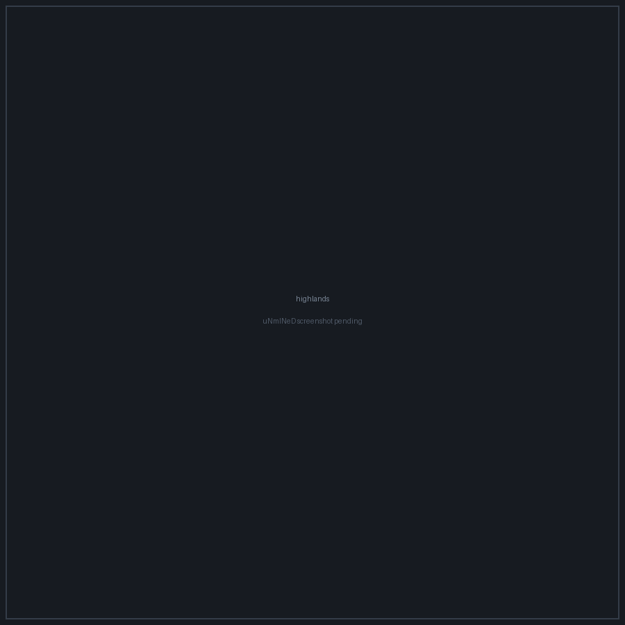

# MineWorldGen

**A configurable world generation data pack for Minecraft Java Edition 26.2,
with a browser world designer that builds it for you.**

Everything is driven by a single `config.json`. Only vanilla blocks and vanilla
biomes are ever used, and with the shipped defaults the pack generates terrain
that is identical to vanilla.

**→ [Open the world designer](https://menonng.github.io/canvasworldgen/)** —
draw a map, press *Export world*, drop the zip into your world. Nothing to
install.

<table>
<tr>
<td align="center"><br><sub><b>earthlike</b></sub></td>
<td align="center"><br><sub><b>archipelago</b></sub></td>
<td align="center"><br><sub><b>pangaea</b></sub></td>
</tr>
<tr>
<td align="center"><br><sub><b>highlands</b></sub></td>
<td align="center"><br><sub><b>waterworld</b></sub></td>
<td align="center"><sub>uNmINeD map renders,<br>seed 1234.<br>See <a href="docs/SCREENSHOTS.md">docs/SCREENSHOTS.md</a></sub></td>
</tr>
</table>

---

## Contents

- [World designer](#world-designer)
- [Quick start](#quick-start)
- [Vanilla fallback](#vanilla-fallback)
- [Presets](#presets)
- [Config reference](#config-reference)
- [Terrain features](#terrain-features)
- [How it works](#how-it-works)
- [Measured results](#measured-results)
- [Tooling](#tooling)
- [Credits](#credits)

---

## World designer

<https://menonng.github.io/canvasworldgen/>

A static page — no account, no upload, no server. Everything runs in the
browser, including the data pack compiler, so the map you draw never leaves your
machine.

**What you draw.** Five independent layers over one grid:

| Layer | What it holds |
|---|---|
| **Land / Ocean** | The coastline. Authoritative: land below sea level and ocean above it are both perfectly ordinary |
| **Elevation** | Target surface height as a real Minecraft Y, not an abstract 0–1 value |
| **Temperature** | The climate parameter the biome source reads, −1 to 1 |
| **Biome** | A pinned vanilla biome, by registry id |
| **Terrain feature** | Intent flags — volcano, atoll, fjord, island arc, tepui, sea stack, columnar jointing and the rest |

Nothing is derived from anything else. In particular land is never inferred from
elevation.

Every layer paints in its own colours, and the Layers panel carries the key for
whichever one is being edited — swatches and canvas read the same palette, so
they cannot disagree. Terrain features get one colour each and a cell carrying
several shows their blend; biomes take map colours from the biome itself, sand
for desert and dark green for jungle, rather than from a hash of an index.
Clicking a swatch sets the brush to that value.

**Controls.** Left-drag paints. Right-drag or middle-drag pans; so does holding
space. The wheel zooms about the cursor. `[` and `]` resize the brush, `1`–`5`
pick a layer, and <kbd>Ctrl</kbd>+<kbd>Z</kbd> / <kbd>Ctrl</kbd>+<kbd>Y</kbd>
undo and redo whole strokes. The elevation brush applies its falloff **while you
draw**, the way a terrain editor does, so *Slope strength* shapes the stroke
itself rather than smoothing it afterwards.

**Brushes.** Three footprints — circle, square, diamond — and a mode set per
layer, since not every operation means anything on every layer:

| Mode | Layers | What it does |
|---|---|---|
| **Paint** | land, temperature, biome | Writes the chosen value |
| **Fill area** | land, biome, feature | Replaces the whole connected region under the cursor in one click |
| **Erase** | all | Returns cells to the layer's default |
| **Raise** / **Lower** | elevation | Moves height by the given amount per stroke |
| **Raise to Y** / **Lower to Y** | elevation | Moves toward a target and stops there, never crossing it |
| **Set to Y** | elevation | Drives height to the target outright |
| **Smooth** | land, elevation, temperature | Averages each cell with its neighbours — on the land mask this is a coastline despeckle |
| **Sharpen** | elevation | The mirror of smooth: deepens the relief that is already there |
| **Flatten** | elevation | Levels everything to the height where the stroke began |
| **Terrace** | elevation | Snaps heights to multiples of a step, for plateaus and tepuis |
| **Roughen** | elevation, temperature | Adds a repeatable per-cell jitter, so the same spot always roughens the same way |
| **Add** / **Remove feature** | feature | Sets or clears one terrain-intent flag, leaving the others alone |

Smoothing and sharpening read the terrain as it was before the current dab, so a
stroke cannot smear its own output across the brush.

**What each brush writes.** Every value a layer can hold is reachable:

| Layer | Values on offer |
|---|---|
| **Land / Ocean** | Land or Ocean |
| **Elevation** | Any Y in the world's build range, bounded by `build_min_y` and the build height, with sea level shown |
| **Temperature** | The climate parameter the biome source reads, −1 to 1, with vanilla's five bands (frozen, cold, temperate, warm, hot) offered by name and their exact spans |
| **Biome** | All 66 biomes in the vanilla 26.2 registry, grouped by dimension with a filter box |
| **Terrain feature** | All 12 flags, set or cleared one at a time |

The biome list and its grouping are generated from the registry itself — the
`26.2-registries` tag for the ids and the `#minecraft:is_overworld` /
`is_nether` / `is_end` tags for the grouping — vendored into
`tools/vanilla/minecraft/biome_registry.json` so the build stays offline.
`npm run biomes` regenerates it, `npm run biomes -- --fetch` refreshes it.

Modes that mean "make it this value" — paint, set, flatten, fill, terrace,
erase, the feature flags — start at full flow, so one click gets there. The
accumulating ones — raise, lower, smooth, sharpen, roughen — start at 0.35 so
they build up as you drag. Either default can be overridden.

**The map is not the world.** Its size is a design surface measured in blocks;
outside it, generation continues forever. A 2000-block map next to a preset
whose continents are 26000 blocks across is a small sketch of a large world.

**Reading the two previews.** They cover the same window, labelled in blocks,
with the design surface outlined on both — so a small design inside a large
generated world reads as a detail of it rather than as a disagreement. What the
two must agree on is the statistics, and the land fraction is the one to watch:
the procedural side reproduces the requested `land_ratio` to within a
percentage point across its whole range, so if it looks nothing like your design
the generator has not been analysed against it yet. The right-hand panel says so
when that is the case; its refresh button re-analyses and rebuilds.

The floor on `land_ratio` is 0.02, so a design with less land than that will
still generate a slightly wetter world than drawn. The export lists that
adjustment rather than applying it silently.

**Two ways out.** *Export project* saves the editor state as JSON — layers,
camera, brush, generator settings — and *Import project* brings it back.
*Export world* compiles a Minecraft data pack zip. The export mode decides how:

| Mode | Result |
|---|---|
| **Vanilla** | Writes no world generation files at all, so terrain is identical to vanilla |
| **Procedural** | A pure data pack. The map is analysed into generator parameters — land ratio, continent size and variation, island size and clustering, ocean depth, what sits at origin — and reproduced statistically. Character and scale survive; absolute coastlines do not |
| **Exact** | Data pack plus a companion mod that samples the map at real X/Z, preserving position and orientation. Not built yet; the button says so |

Procedural Export cannot reproduce your coastlines because no vanilla density
function reads world X or Z — all 34 types were checked against the 26.2
registry. That is the whole reason the Exact mode exists.

**Analysis panel.** *Analyse map* reports what it read and fills the config box
with the exact `config.json` the compiler will use. Edit it in place and press
*Apply edits*; a preset can be loaded first and refined by hand. Out-of-range
values are pulled to the nearest bound rather than rejected, and every
adjustment is listed after the export.

The compiler in the browser is a port of the Python one in `tools/`, and
`web/test/parity.mjs` checks that the two produce byte-for-byte equal packs for
every preset. `web/test/smoke.mjs` drives the real page in headless Chromium —
every brush on every layer, all three shapes, panning, zoom anchoring, presets,
config edits, both export modes, the preview refresh buttons, the Korean strings
and a project round trip.

```bash
cd web
npm install
npm run bundle        # src/ -> ../app.js, ../style.css, and web/index.html
npm run typecheck
npm run test:parity   # browser compiler == Python compiler
npm run test:smoke    # drives the page in headless Chromium
```

The published site is the repository root: `index.html`, `app.js`, `style.css`
and `presets/`. GitHub Pages serves it in branch mode; `.nojekyll` keeps Jekyll
out of the way.

**Languages.** English and Korean, switchable in the header. Everything the
editor says in its own voice is translated: panels, brushes, the terrain-feature
vocabulary, the analysis report and the compiler's clamping messages. Minecraft's
own names are not — biome and block ids stay as registry ids such as
`minecraft:plains`, because that is what the data pack writes and what a player
searches for in the game. English is the fallback, so a partial translation is
always safe. [`docs/TRANSLATION_KEYS.md`](docs/TRANSLATION_KEYS.md) lists every
key with both languages side by side; `npm run keys` regenerates it.

---

## Quick start

Prefer files to a browser? The pack builds from the command line too.

**Requirements** — Minecraft Java Edition **26.2** (data pack format 107). No
mods. Python 3.9+ is needed only when you change a setting, and only the
standard library is used.

```bash
git clone https://github.com/menonng/canvasworldgen
cd canvasworldgen

# 1. pick a preset, or edit pack/config.json by hand
cp presets/earthlike.json pack/config.json

# 2. build the data pack files
python3 tools/apply_config.py

# 3. drop pack/ into a world's datapacks/ folder (a zip works too)
cp -r pack "<.minecraft>/saves/<world>/datapacks/canvasworldgen"
```

> Terrain is decided when a chunk is first generated. Change the config and
> you need a **new world** — existing chunks keep the terrain they were born
> with.

`config.json` accepts `//` and `/* */` comments.

Every setting is **clamped, never rejected**. A value above its maximum is
pulled down to the maximum, a value below its minimum is pulled up, a
nonsensical combination is resolved in favour of whichever setting you most
likely care about, and the pack is written either way. The generator prints
exactly what it changed:

```
$ python3 tools/apply_config.py
adjusted out-of-range settings:
  - continents.width lowered from 100000 to 12660 (max ratio 1:1.81)
  - oceans.ocean_depth_blocks was deeper than deep_ocean_depth_blocks, lowered to 58
wrote data pack to /home/user/mineworldgen/pack
```

---

## Vanilla fallback

The first key in `config.json` is `mode`:

```jsonc
"mode": "vanilla"   // default — writes no world generation files at all
"mode": "custom"    // applies everything else in the file
```

At `"vanilla"` the generator emits **no world generation file whatsoever**. The
pack contains one unreferenced density function and nothing else, so vanilla's
own files are never shadowed and terrain is identical by construction.

Every preset file sets `"mode": "custom"`.

---

## Presets

Click the copy button on a code block and paste it straight into
`pack/config.json`.

<details>
<summary><b>earthlike</b> — balanced continents and oceans. Start here.</summary>

Several slightly east–west elongated continents, about 29% land, with island
chains and volcanic islands between them. Spawn is pinned to the central
continent.

```json
{
  "format": 1,
  "mode": "custom",
  "world": { "sea_level": 63, "build_min_y": -64, "build_height": 384,
             "terrain_max_y": 300, "terrain_min_y": -44, "vertical_scale": 1.0 },
  "center": { "type": "continent", "radius": 3000, "strength": 1.0 },
  "continents": {
    "land_ratio": 0.29, "width": 9000, "height": 7000,
    "width_variation_percent": 35, "height_variation_percent": 35,
    "erosion_scale": 1.0, "ridge_scale": 1.0, "flat_terrain_skew": 0.10,
    "mountain_ranges": 1.0, "plateaus": 1.0, "tepui": 0.6, "rolling_hills": true
  },
  "rivers": { "enabled": true, "width": 1.1, "depth_blocks": 11 },
  "inland_seas": { "enabled": true, "frequency": 0.35, "size": 3500, "depth_blocks": 28 },
  "fjords": { "enabled": true, "frequency": 0.5, "width": 1.0, "depth_blocks": 26 },
  "islands": { "enabled": true, "size": 800, "frequency": 1.0, "clustering": 0.55,
               "arc_strength": 0.7, "noise_offset": 0.05,
               "atoll_chance": 0.15, "volcanic_chance": 0.18, "cliff_chance": 0.20 },
  "oceans": { "ocean_depth_blocks": 30, "deep_ocean_depth_blocks": 62,
              "seafloor_relief": 1.0, "trenches": true, "trench_depth_blocks": 36 },
  "coast": { "cliffs": 0.6, "sea_stacks": 0.5, "columnar_jointing": 0.5 },
  "biomes": { "scale_with_continents": true, "temperature_scale": 1.0, "temperature_offset": 0.0,
              "temperature_multiplier": 1.0, "vegetation_scale": 1.0, "vegetation_offset": 0.0,
              "vegetation_multiplier": 1.0 },
  "caves": { "scale_with_continents": true, "size_multiplier": 1.0, "carvers_enabled": true },
  "structures": { "scale_with_continents": true, "spacing_multiplier": 1.0 },
  "spawn": { "force_land_spawn": true }
}
```
</details>

<details>
<summary><b>archipelago</b> — deep ocean scattered with tight island chains, atolls and volcanoes.</summary>

About 10–15% land. Islands bunch into curved chains, with a high share of
atolls and volcanic islands. Spawn sits in the middle of the central
archipelago, and structure spacing is tightened so most islands have something
on them.

```json
{
  "format": 1,
  "mode": "custom",
  "world": { "sea_level": 63, "build_min_y": -64, "build_height": 384,
             "terrain_max_y": 288, "terrain_min_y": -48, "vertical_scale": 1.0 },
  "center": { "type": "archipelago", "radius": 3500, "strength": 1.0 },
  "continents": {
    "land_ratio": 0.15, "width": 2600, "height": 2600,
    "width_variation_percent": 45, "height_variation_percent": 45,
    "erosion_scale": 0.8, "ridge_scale": 0.9, "flat_terrain_skew": 0.10,
    "mountain_ranges": 0.9, "plateaus": 0.7, "tepui": 0.8, "rolling_hills": true
  },
  "rivers": { "enabled": true, "width": 0.8, "depth_blocks": 9 },
  "inland_seas": { "enabled": false, "frequency": 0.0, "size": 3000, "depth_blocks": 26 },
  "fjords": { "enabled": true, "frequency": 0.8, "width": 1.2, "depth_blocks": 28 },
  "islands": { "enabled": true, "size": 520, "frequency": 1.8, "clustering": 0.8,
               "arc_strength": 1.2, "noise_offset": 0.09,
               "atoll_chance": 0.26, "volcanic_chance": 0.26, "cliff_chance": 0.24 },
  "oceans": { "ocean_depth_blocks": 26, "deep_ocean_depth_blocks": 54,
              "seafloor_relief": 1.3, "trenches": true, "trench_depth_blocks": 40 },
  "coast": { "cliffs": 0.9, "sea_stacks": 1.0, "columnar_jointing": 0.9 },
  "biomes": { "scale_with_continents": true, "temperature_scale": 1.0, "temperature_offset": 0.25,
              "temperature_multiplier": 0.9, "vegetation_scale": 1.0, "vegetation_offset": 0.15,
              "vegetation_multiplier": 1.0 },
  "caves": { "scale_with_continents": true, "size_multiplier": 1.0, "carvers_enabled": true },
  "structures": { "scale_with_continents": false, "spacing_multiplier": 0.7 },
  "spawn": { "force_land_spawn": true }
}
```
</details>

<details>
<summary><b>pangaea</b> — one enormous supercontinent with inland seas and long rivers.</summary>

A landmass roughly 42 000 × 26 000 blocks, about 55% land. Inland seas grow
large and rivers grow wide. Climate zones, cave systems and structure spacing
all scale up with the continent automatically.

```json
{
  "format": 1,
  "mode": "custom",
  "world": { "sea_level": 63, "build_min_y": -64, "build_height": 384,
             "terrain_max_y": 306, "terrain_min_y": -40, "vertical_scale": 1.15 },
  "center": { "type": "continent", "radius": 12000, "strength": 1.0 },
  "continents": {
    "land_ratio": 0.55, "width": 42000, "height": 26000,
    "width_variation_percent": 20, "height_variation_percent": 20,
    "erosion_scale": 1.4, "ridge_scale": 1.5, "flat_terrain_skew": 0.14,
    "mountain_ranges": 1.25, "plateaus": 1.2, "tepui": 0.8, "rolling_hills": true
  },
  "rivers": { "enabled": true, "width": 1.6, "depth_blocks": 14 },
  "inland_seas": { "enabled": true, "frequency": 0.6, "size": 9000, "depth_blocks": 34 },
  "fjords": { "enabled": true, "frequency": 0.4, "width": 1.0, "depth_blocks": 26 },
  "islands": { "enabled": true, "size": 1400, "frequency": 0.6, "clustering": 0.3,
               "arc_strength": 0.3, "noise_offset": 0.03,
               "atoll_chance": 0.10, "volcanic_chance": 0.20, "cliff_chance": 0.20 },
  "oceans": { "ocean_depth_blocks": 32, "deep_ocean_depth_blocks": 66,
              "seafloor_relief": 0.9, "trenches": true, "trench_depth_blocks": 30 },
  "coast": { "cliffs": 0.5, "sea_stacks": 0.35, "columnar_jointing": 0.4 },
  "biomes": { "scale_with_continents": true, "temperature_scale": 1.0, "temperature_offset": 0.0,
              "temperature_multiplier": 1.15, "vegetation_scale": 1.0, "vegetation_offset": -0.1,
              "vegetation_multiplier": 1.0 },
  "caves": { "scale_with_continents": true, "size_multiplier": 1.0, "carvers_enabled": true },
  "structures": { "scale_with_continents": true, "spacing_multiplier": 1.0 },
  "spawn": { "force_land_spawn": true }
}
```
</details>

<details>
<summary><b>highlands</b> — build height raised to 512, terrain reaching y 430, deep fjords.</summary>

`build_height` goes to 512 with a 1.6 vertical scale. Cliff islands and
volcanic islands dominate the ocean, fjords cut deep into the coast, and
plateaus and tepuis are pushed hard. The dimension type is overridden too,
because the world is taller than vanilla.

```json
{
  "format": 1,
  "mode": "custom",
  "world": { "sea_level": 63, "build_min_y": -64, "build_height": 512,
             "terrain_max_y": 430, "terrain_min_y": -50, "vertical_scale": 1.6 },
  "center": { "type": "island", "radius": 2200, "strength": 1.0 },
  "continents": {
    "land_ratio": 0.34, "width": 7000, "height": 7000,
    "width_variation_percent": 30, "height_variation_percent": 30,
    "erosion_scale": 1.2, "ridge_scale": 1.1, "flat_terrain_skew": 0.06,
    "mountain_ranges": 1.7, "plateaus": 1.5, "tepui": 1.4, "rolling_hills": true
  },
  "rivers": { "enabled": true, "width": 1.0, "depth_blocks": 13 },
  "inland_seas": { "enabled": true, "frequency": 0.25, "size": 2800, "depth_blocks": 30 },
  "fjords": { "enabled": true, "frequency": 0.9, "width": 1.3, "depth_blocks": 40 },
  "islands": { "enabled": true, "size": 650, "frequency": 1.1, "clustering": 0.6,
               "arc_strength": 0.8, "noise_offset": 0.05,
               "atoll_chance": 0.10, "volcanic_chance": 0.32, "cliff_chance": 0.38 },
  "oceans": { "ocean_depth_blocks": 34, "deep_ocean_depth_blocks": 74,
              "seafloor_relief": 1.4, "trenches": true, "trench_depth_blocks": 36 },
  "coast": { "cliffs": 1.3, "sea_stacks": 1.2, "columnar_jointing": 1.2 },
  "biomes": { "scale_with_continents": true, "temperature_scale": 1.0, "temperature_offset": -0.15,
              "temperature_multiplier": 1.1, "vegetation_scale": 1.0, "vegetation_offset": 0.0,
              "vegetation_multiplier": 1.0 },
  "caves": { "scale_with_continents": true, "size_multiplier": 1.3, "carvers_enabled": true },
  "structures": { "scale_with_continents": true, "spacing_multiplier": 1.0 },
  "spawn": { "force_land_spawn": true }
}
```
</details>

<details>
<summary><b>waterworld</b> — warm ocean, small islands and coral atolls.</summary>

Small islands only, with a 34% atoll share. The climate is pushed warm and wet
so coral reefs and jungle islands are common, and structure spacing is halved
to keep shipwrecks and ocean ruins plentiful.

```json
{
  "format": 1,
  "mode": "custom",
  "world": { "sea_level": 63, "build_min_y": -64, "build_height": 384,
             "terrain_max_y": 260, "terrain_min_y": -52, "vertical_scale": 0.9 },
  "center": { "type": "island", "radius": 1400, "strength": 1.0 },
  "continents": {
    "land_ratio": 0.15, "width": 1800, "height": 1800,
    "width_variation_percent": 50, "height_variation_percent": 50,
    "erosion_scale": 0.7, "ridge_scale": 0.8, "flat_terrain_skew": 0.10,
    "mountain_ranges": 0.7, "plateaus": 0.6, "tepui": 0.5, "rolling_hills": true
  },
  "rivers": { "enabled": true, "width": 0.7, "depth_blocks": 8 },
  "inland_seas": { "enabled": false, "frequency": 0.0, "size": 3000, "depth_blocks": 26 },
  "fjords": { "enabled": true, "frequency": 0.7, "width": 1.1, "depth_blocks": 22 },
  "islands": { "enabled": true, "size": 380, "frequency": 1.1, "clustering": 0.35,
               "arc_strength": 1.5, "noise_offset": 0.11,
               "atoll_chance": 0.34, "volcanic_chance": 0.22, "cliff_chance": 0.16 },
  "oceans": { "ocean_depth_blocks": 24, "deep_ocean_depth_blocks": 50,
              "seafloor_relief": 1.5, "trenches": true, "trench_depth_blocks": 44 },
  "coast": { "cliffs": 0.7, "sea_stacks": 1.1, "columnar_jointing": 0.8 },
  "biomes": { "scale_with_continents": true, "temperature_scale": 1.2, "temperature_offset": 0.30,
              "temperature_multiplier": 0.85, "vegetation_scale": 1.2, "vegetation_offset": 0.20,
              "vegetation_multiplier": 0.9 },
  "caves": { "scale_with_continents": true, "size_multiplier": 1.0, "carvers_enabled": true },
  "structures": { "scale_with_continents": false, "spacing_multiplier": 0.55 },
  "spawn": { "force_land_spawn": true }
}
```
</details>

<details>
<summary><b>vanilla</b> — the pass-through default.</summary>

```json
{
  "format": 1,
  "mode": "vanilla"
}
```
</details>

---

## Config reference

### `world`

| Key | Default | Range | Meaning |
|---|---|---|---|
| `sea_level` | 63 | −2032 … 2032 | Sea level of the dimension |
| `build_min_y` | −64 | multiple of 16 | Lowest buildable y |
| `build_height` | 384 | multiple of 16, ≤ 4064 | Total world height |
| `terrain_max_y` | 312 | inside the build limits | Highest the land surface may reach |
| `terrain_min_y` | −40 | inside the build limits | Lowest the sea floor may reach |
| `vertical_scale` | 1.0 | 0.1 … 4.0 | Multiplier for everything above sea level |

Changing `build_min_y` or `build_height` away from vanilla also writes a
`dimension_type` override.

### `center` — what sits at world origin

| Value | Result |
|---|---|
| `"default"` | Leave it to the noise |
| `"continent"` | A large continent |
| `"island"` | One big island |
| `"archipelago"` | A cluster of islands |
| `"ocean"` | Open ocean |

`radius` (blocks, default 2500) sets how far the influence reaches and
`strength` (0 … 2) how strong it is. The edge fades out smoothly.

### `continents`

| Key | Default | Meaning |
|---|---|---|
| `land_ratio` | 0.32 | Fraction of the world above sea level |
| `ocean_offset` | `null` | Advanced: drive the raw skew directly, ignoring `land_ratio` |
| `width` | 6000 | Mean west–east extent of one landmass, in blocks |
| `height` | 6000 | Mean north–south extent, in blocks |
| `width_variation_percent` | 30 | How far each shoreline wanders from that width |
| `height_variation_percent` | 30 | Same for the north–south extent |
| `erosion_scale` | 1.0 | Horizontal scale of the erosion field |
| `ridge_scale` | 1.0 | Horizontal scale of the ridge field; also controls how many rivers there are |
| `flat_terrain_skew` | 0.10 | Where plateau terrain gives way to flat terrain |
| `mountain_ranges` | 1.0 | Mountain range strength, 0 disables |
| `plateaus` | 1.0 | Plateau strength |
| `tepui` | 0.6 | Tepui strength (tropical regions only) |
| `rolling_hills` | `true` | Gentle hill terrain |

`width` and `height` are kept within a 1 : 1.81 ratio of each other.

### `rivers`, `inland_seas`, `fjords`

| Key | Default | Meaning |
|---|---|---|
| `rivers.enabled` | `true` | Rivers running across the continents |
| `rivers.width` | 1.0 | River width, 1.0 matches vanilla |
| `rivers.depth_blocks` | 10 | How far the river bed cuts below sea level |
| `inland_seas.enabled` | `true` | Enclosed seas inside continents |
| `inland_seas.frequency` | 0.35 | Share of continental interior covered |
| `inland_seas.size` | 3000 | Mean diameter in blocks |
| `inland_seas.depth_blocks` | 26 | Depth below sea level |
| `fjords.enabled` | `true` | Narrow steep-walled inlets |
| `fjords.frequency` | 0.6 | Share of rocky coast that gets them |
| `fjords.width` | 1.0 | Inlet width |
| `fjords.depth_blocks` | 24 | Inlet depth |

Rivers and fjords both follow the valleys of vanilla's weirdness field, so
vanilla puts River biomes in the rivers and ocean biomes in the drowned
valleys without any extra work.

### `islands`

| Key | Default | Meaning |
|---|---|---|
| `enabled` | `true` | |
| `size` | 700 | Mean island diameter in blocks |
| `frequency` | 1.0 | How much of the deep ocean gets islands |
| `clustering` | 0.5 | 0 spreads islands evenly, 1 packs them into tight groups |
| `arc_strength` | 0.6 | How strongly islands line up along curved chains |
| `noise_offset` | 0.05 | Raises or lowers every island; lower means more mushroom islands |
| `atoll_chance` | 0.18 | Share of islands that become atolls |
| `volcanic_chance` | 0.20 | Share that become volcanoes |
| `cliff_chance` | 0.22 | Share that become cliff/mountain islands |

The three shares are scaled down if they sum above 0.95; the remainder are
ordinary islands.

### `oceans`, `coast`

| Key | Default | Meaning |
|---|---|---|
| `oceans.ocean_depth_blocks` | 28 | Ordinary ocean depth below sea level |
| `oceans.deep_ocean_depth_blocks` | 58 | Deep ocean depth |
| `oceans.seafloor_relief` | 1.0 | Sea floor bumpiness |
| `oceans.trenches` | `true` | Deep linear trenches through the abyssal plains |
| `oceans.trench_depth_blocks` | 34 | Extra depth in a trench |
| `coast.cliffs` | 0.6 | Sheer rock coastline instead of gentle beach |
| `coast.sea_stacks` | 0.5 | Isolated rock pillars just offshore |
| `coast.columnar_jointing` | 0.5 | Flat-topped stepped columns along rocky shores |

### `biomes`

| Key | Default | Meaning |
|---|---|---|
| `scale_with_continents` | `true` | Grow the climate noise together with the continents |
| `temperature_scale` | 1.0 | Extra multiplier on climate zone size |
| `temperature_offset` | 0.0 | Shift the whole world warmer (+) or colder (−) |
| `temperature_multiplier` | 1.0 | Push climates toward the extremes |
| `vegetation_scale` / `_offset` / `_multiplier` | | Same three knobs for humidity |

Without the synchronisation a 42 000-block continent ends up with a
checkerboard of biomes. In the `pangaea` preset the climate noise grows about
**21×** automatically.

### `caves`, `structures`, `spawn`

| Key | Default | Meaning |
|---|---|---|
| `caves.scale_with_continents` | `true` | Cave systems grow with the world (`size_factor^0.35`, capped at 2.5×) |
| `caves.size_multiplier` | 1.0 | Direct cave size multiplier |
| `caves.carvers_enabled` | `true` | Classic cave and ravine carvers |
| `structures.scale_with_continents` | `true` | Structure spacing scales with the world (`size_factor^0.5`, capped at 6×) |
| `structures.spacing_multiplier` | 1.0 | Direct spacing multiplier |
| `spawn.force_land_spawn` | `true` | Keep the world spawn on land |

Cave size is changed by moving the octaves of vanilla's cave noises.
Fractional factors are reached by blending the amplitude arrays of the two
neighbouring octave shifts, so 1.3× really is 1.3×.

Structure spacing is applied by reading the real 26.2 `structure_set` files and
rewriting `spacing` and `separation` proportionally, across the 17 Overworld
sets. At a multiplier of 1.0 no structure file is written at all.

---

## Terrain features

All of these are built from vanilla blocks and land in vanilla biomes.

| Feature | How it is produced |
|---|---|
| **Mountain ranges** | A domain-warped ridge field (`1 − \|n\|`) is subtracted from erosion, creating **linear** low-erosion bands. Mountains form chains instead of scattered blobs. |
| **Plateaus** | A stepped spline of flat treads and steep risers, combined with a high `factor` |
| **Tepuis** | The same idea taken to the extreme: a 0.04-wide band rises almost vertically to 0.86. Placed only where the vegetation field is high, so they land in the tropics |
| **Sea cliffs** | Where erosion is low at the coast the offset jumps and `factor` rises from 5.6 to 9.5, which reads as vertical rock |
| **Sea stacks** | Intersecting the ridges of two independent noises with `min` leaves isolated **points** rather than lines. Those points rise inside the coastal mask |
| **Columnar jointing** | The same intersection at an 8-block scale, with a spline of flat 3-block treads, giving clusters of flat-topped columns |
| **Island arcs** | The zero set of a low-frequency noise is a smooth **curve** across the world. Raising island probability along that curve produces naturally bowed island chains |
| **Atolls** | The island height value passes through a ring-shaped spline: the mid band rises above water and the centre drops back below it. Temperature is nudged +0.35 so they land in warm seas |
| **Volcanic islands** | A spline that climbs steeply and then dips again at the very summit, producing a crater |
| **Mountain islands** | Island erosion is forced down to −0.95 so vanilla picks peak biomes |
| **Rivers** | The offset drops along the weirdness valleys, exactly where vanilla places River biomes |
| **Fjords** | The same valleys, filtered by coast proximity, low erosion and a separate selector noise, cut far deeper |
| **Inland seas** | A low-frequency field lowers both the offset and the continentalness inland, so beaches and ocean biomes form around the water |
| **Ocean trenches** | Narrow ridge-field valleys in the deep ocean cut further down |

---

## How it works

### Vanilla plus a patch

The pack does not imitate vanilla; it **reads the real 26.2 files and edits
them**. `tools/vanilla/minecraft/` holds unmodified Minecraft 26.2 world
generation data, and the generator writes out only what it changed:

```
data/minecraft/worldgen/density_function/overworld/
    continents.json  erosion.json  ridges.json
    offset.json      factor.json   jaggedness.json   depth.json
data/minecraft/worldgen/noise_settings/overworld.json   (climate router, sea level, height, spawn target)
data/minecraft/dimension_type/overworld.json            (only when the world height changes)
data/minecraft/worldgen/noise/<cave noises>.json        (only when cave size changes)
data/minecraft/worldgen/structure_set/*.json            (only when structure spacing changes)
```

Biome placement is untouched. Vanilla's multi-noise biome source still reads
`continentalness / erosion / weirdness / temperature / humidity / depth`, so the
only biomes that can appear are vanilla biomes. Surface rules, carvers, ore
veins and structure definitions are all vanilla as well — including
`sulfur_caves`, added in 26.2.

### The density function graph

About 60 density functions and 30 noises are written into the `mwg` namespace.

```
mwg:parameter/continentalness ──blur(7 taps)──► mwg:noise/continent_raw
                                                        │
mwg:size_bias/{width,height} ──blur(9 taps)──► mwg:noise/size_bias
mwg:center/ring1..4 ──────────────────────────► mwg:center/bias
                                                        ▼
                                          mwg:noise/raw_continents
                                          ├─► mwg:selector/island  ─┐
                                          └─► mwg:selector/continent│
                                                                    │
mwg:island/{a,b,cluster,arc,type} ─► mwg:noise/raw_islands ─────────┤
                                                                    ▼
                                       mwg:noise/full_continents ──► minecraft:overworld/continents
mwg:mountain/{base,detail,warp} ─► mwg:mountain/ridges ─┐
mwg:parameter/erosion ──────────────────────────────────┴─► mwg:biome/erosion ──► minecraft:overworld/erosion
mwg:parameter/ridge ───────────────► mwg:biome/ridges ────────────────────────► minecraft:overworld/ridges
                                     mwg:biome/ridges_folded (= 1 − 3·||r| − ⅔|)
                                                │
        ┌───────────────────────────────────────┴──────────────────────────┐
        ▼                                                                  ▼
mwg:water/{river,fjord,inland_sea} ─► mwg:water/carve        mwg:terrain/offset_{continents,islands}
mwg:terrain/{ocean_relief,coast_features} ───────────────────┴─► minecraft:overworld/offset
                                                              ─► minecraft:overworld/factor
                                                              ─► minecraft:overworld/jaggedness
```

Every setting becomes a constant density function under
`data/mwg/worldgen/density_function/config/`, so the numbers can also be edited
by hand without running the script:

```json
{ "type": "minecraft:constant", "argument": -1.0342 }
```

### Height and offset

Vanilla's `overworld/depth` loses exactly `1/128` per block, so **one unit of
terrain offset is 128 blocks of elevation** and the surface sits at
`min_y + height/2 + 128 · offset`. Every block-valued setting — ocean depths,
terrain limits, river depth, the 3-block treads of columnar jointing — is
converted through that identity rather than fitted.

### Spawn safety

Two layers. The `spawn_target` in the noise settings is narrowed to
`continentalness ≥ 0.03`, so vanilla's own spawn search only considers inland
climate. Then `mwg:spawn/*` checks each player's footing on first join and, if
they are in water, relocates them with an expanding search from 400 up to
36 000 blocks before pinning the world spawn to the land it finds.

---

## Measured results

The numbers below are simulated, not estimated. `tools/mwgnoise` reimplements
Minecraft's Xoroshiro128++ random source, the
`ImprovedNoise` / `PerlinNoise` / `NormalNoise` stack and the density-function
evaluator, and runs over the JSON the generator actually writes.

```bash
python3 tools/measure.py --all-presets --markdown   # regenerates this table
python3 tools/validate.py                            # checks every preset
```

Three seeds each, sampled over at least 51 200 blocks square:

| preset | land ratio req/meas | continent req | continent measured | island req/meas | ocean depth med/p95 | surface y range |
|---|---|---|---|---|---|---|
| `archipelago` | 0.15 / **0.11** | 2600 × 2600 | **2808 × 2879** (n=150) | 520 / **848** | **26** / 55 | **−39 … 242** |
| `earthlike` | 0.29 / **0.25** | 9000 × 7000 | **10015 × 8867** (n=27) | 800 / **1436** | **29** / 64 | **−41 … 261** |
| `highlands` | 0.34 / **0.32** | 7000 × 7000 | **9253 × 9740** (n=35) | 650 / **1452** | **34** / 76 | **−50 … 430** |
| `pangaea` | 0.55 / **0.49** | 42000 × 26000 | **67360 × 41086** (n=151) | 1400 / — | **31** / 68 | **−38 … 306** |
| `waterworld` | 0.15 / **0.21** | 1800 × 1800 | **1716 × 1689** (n=735) | 380 / **659** | **20** / 52 | **−38 … 194** |

Land ratio lands within about 0.05 of the request, landmass size within about
25%, and the surface stays inside `terrain_min_y … terrain_max_y` exactly —
`highlands` asks for −50 … 430 and measures −50 … 430. Ocean depth matches the
request almost exactly because it is a unit conversion rather than a fit. At
`pangaea`'s 0.55 land ratio landmasses merge into each other, so a single
"continent size" stops being a meaningful measurement there.

Full numbers: [`docs/measurements.json`](docs/measurements.json).
The measurements behind each calibration constant:
[`docs/CALIBRATION.md`](docs/CALIBRATION.md).

---

## Tooling

Everything under `tools/` runs standalone. Only `apply_config.py` is needed to
use the pack, and it has no dependencies; the rest need `numpy`, `scipy` and
`pillow`.

| Script | What it does |
|---|---|
| `apply_config.py` | `config.json` → data pack. **No dependencies** |
| `validate.py` | Builds every preset and checks JSON parsing, reference resolution, spline monotonicity, graph cycles and live evaluation |
| `measure.py` | Simulates a generated pack and measures land ratio, landmass size, ocean depth and height range |
| `render.py` | Quick heightmap preview straight from the pack's JSON |
| `calibrate.py` | Rebuilds `mwgbuild/calibration.json` from fresh measurements |
| `mwgnoise/` | Minecraft noise and density-function simulator |
| `mwgbuild/` | The data pack generator |
| `vanilla/` | Vanilla 26.2 world generation data, used as the patch base |

The editor lives under `web/`:

| Path | What it does |
|---|---|
| `web/src/` | The editor — layers and brushes, canvas rendering, map analysis, i18n |
| `web/src/pack/` | The data pack compiler, ported from `tools/mwgbuild/` |
| `web/test/parity.mjs` | Proves the browser compiler and the Python one agree |
| `web/test/smoke.mjs` | Drives the published page in headless Chromium |
| `web/tools/translation-keys.mjs` | Regenerates `docs/TRANSLATION_KEYS.md` |
| `web/tools/biome-list.mjs` | Regenerates `web/src/biomes.ts` from the vendored biome registry |

Two more, for using MineWorldGen next to a decoration pack:

| Script | What it does |
|---|---|
| `port_pack.py` | Ports a 1.21.10 world generation data pack to 26.2. Every migration rule is derived by diffing the two versions' vanilla data, and the derivation is written above the rule |
| `validate_pack.py` | Checks that a pack only names feature types, placement modifiers and ids that Minecraft 26.2 has. `--with <pack>` counts a companion pack's definitions too, for add-ons |

MineWorldGen writes density functions, noise settings and structure sets;
a decoration pack writes biomes and features. Measured against William Wythers'
Overhauled Overworld, the two share **no** world generation file, so they
compose: this pack shapes the terrain, that one dresses it.

```
$ python3 tools/validate.py
ok    vanilla-default
ok    archipelago.json
ok    earthlike.json
ok    highlands.json
ok    pangaea.json
ok    vanilla.json
ok    waterworld.json

all packs valid
```

---

## Credits

The design draws on:

* **[Tectonic](https://github.com/Apollounknowndev/tectonic)** by Apollo — the
  shape of the config, exposing settings as constant density functions, the
  continent/island selector structure and the noise octave tuning
* **[Continents](https://modrinth.com/datapack/continents)** by Stardust Labs —
  the dual-scale sampling trick that lets a data pack find world origin
* **IslandGen** by MrRoaw — the minimal way to rewrite `continents` into an
  island world
* **[ReTerraForged](https://github.com/racoonman2/ReTerraForged)** by racoonman2
  — the naming and structure of settings like `continentScale`,
  `continentJitter`, `continentSizeVariance` and `SpawnType`
* Vanilla 26.2 world generation data comes from the `26.2-data` tag of
  [misode/mcmeta](https://github.com/misode/mcmeta)

The code and the terrain graph in this repository are original; no files from
those data packs are copied.

Licensed under the MIT License — see [LICENSE](LICENSE).
